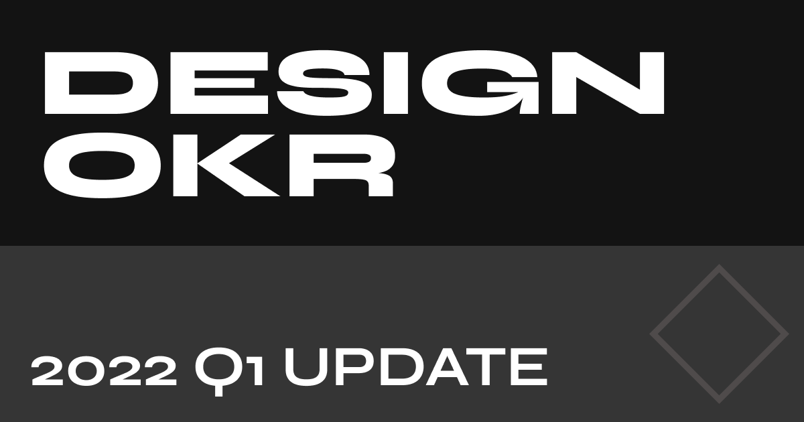

## Key Achievements

It's a new year and quite a lot has been achieved this quarter. First of all, I have wrote my personal blog from scratch using NextJS as part of my practice. The hardest part was the API and synchronising with rss feed & Spotify. I also Redeployed [juxtdesign.cc](https://juxtdesign.cc)

## Record

### [[Be knowledgable]]

### [[Design System Research]]

-

### [[Logging Design Decisions & Portfolio]]

### [[Participate and Contribute Design Community]]

- #### [[Write 4 Blogs about coding and design]]
- #### [[Join 3 tech meetups and conferences]]
