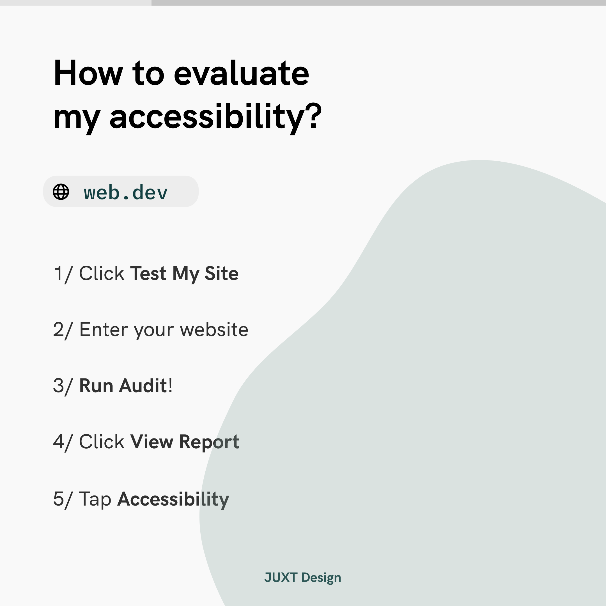

The first tip from [@juxtdesign](https://instagram.com/juxtdesignco) is Accessibility ✌️ ! Accessibility matters because making your site accessible meaning even more people (more than 1 billion disabled people in the world 🧑‍🦯🧏🧑‍🦽) can easily access your site. It stands for diversity and inclusion for your company and there are guidelines for you to follow.

## Step 1: How to evaluate my site's accessibility?

Use [Web.dev](https://web.dev) or [WAVE](https://wave.webaim.org) to spot out the accessibility problems on your website. Little effort to your site can make your accessibility score up to 90+.

 

You can also use [Stark](https://getstark.co) on Figma & Sketch when you are designing app interfaces.

## Step 2: Quick wins to make your site accessible

Add alt text to images on your website to make your images speak for themselves. You can also double-check your [color contrast](https://coolors.co/contrast-checker) is accessible to visually impaired users. Keep in mind that your site should be properly organized in a hierarchy.

## Step 3: There is no step 3! Sit and wait for more traffics to come over time.

Have I mentioned accessible websites are easier found by search engines as well?
