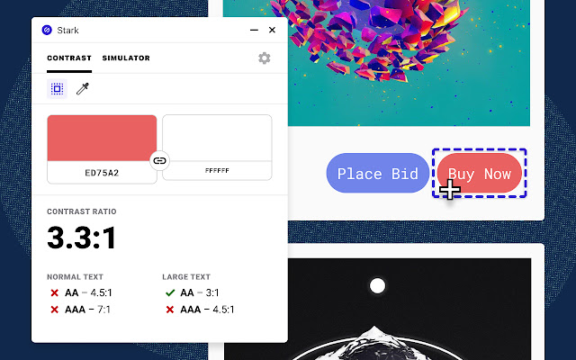

Stark has been a very helpful tool for creating accessible designs. The all-in-one accessibility toolkit has launched [Chrome version](https://chrome.google.com/webstore/detail/stark/fkfaapnmfippddbeemjjbclenphooipm) after focusing on design platforms like Figma, Sketch and Adobe XD.

Two main features launched today include color contrast checker and colorblind simulation. Smart color suggestion, recommendation of alternative colors if the contrast does not pass WCAG 2.0 level, however, has yet to found on Chrome. it is a feature that I use all the time.
