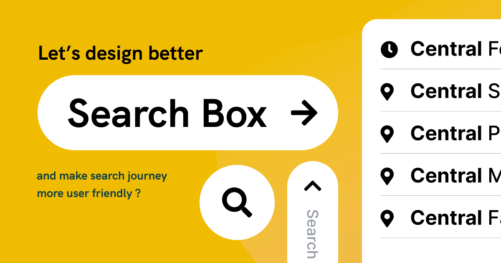
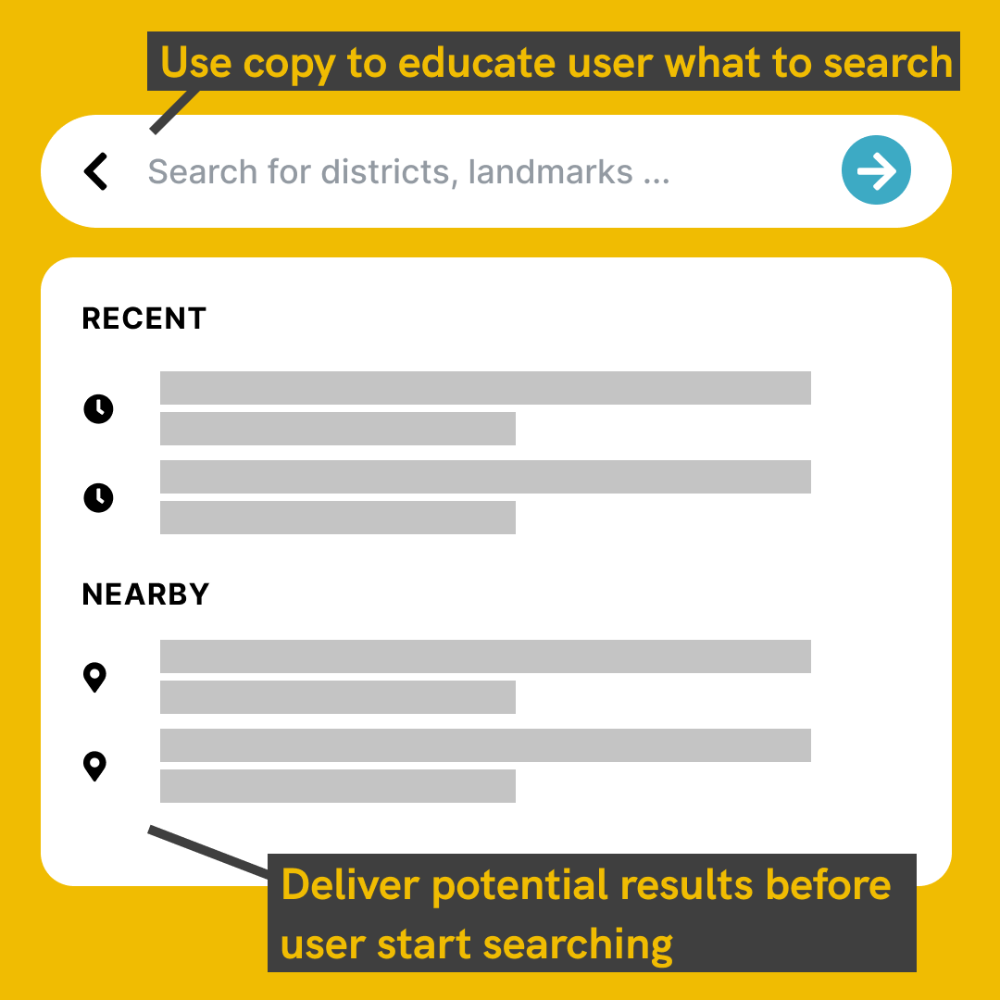
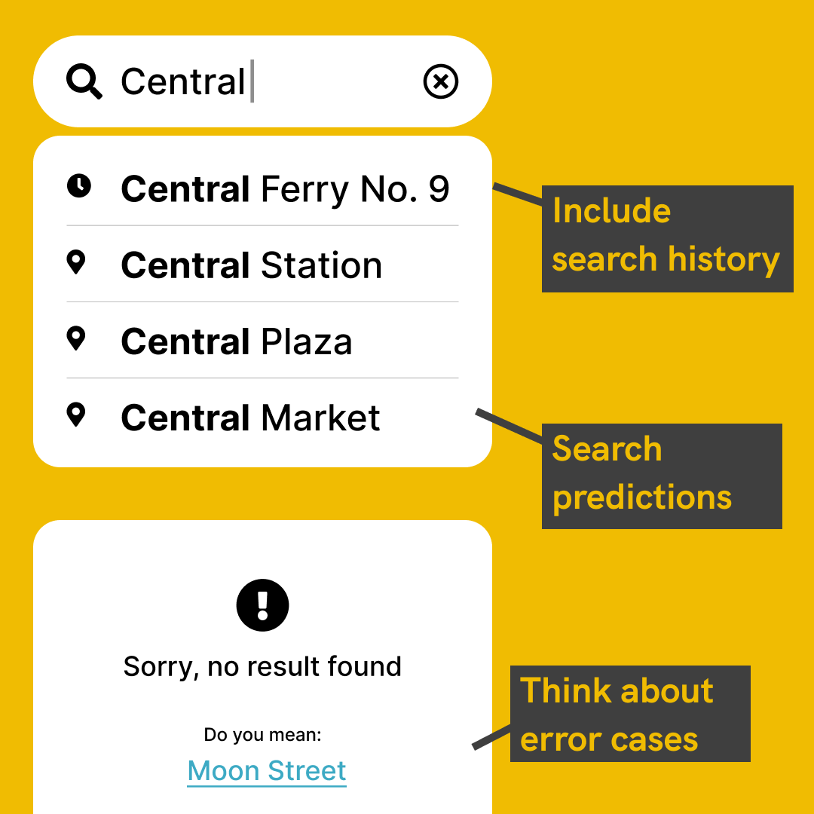

Recently, I worked on a concept design for a Electric Vehicle Charging Map App. Here's a recap of my thinking process, — how to enhance usability for a Search Journey?

At first thought, you may think a search journey is easy and simple, all you need is Search page and Result page. But how do you define and track the success of a search?

## Let’s talk about metrics:

Landing to a result page might not necessarily means the search is successful, did users find answer that they expect? We would also want to minimize search time as well.

Here’s some tips for enhancing usability for search journeys:

- Use copy to educate user "What I can search”
- Add Search history
- Add Search predictions
- Think of error scenarios (e.g. for typo)
- Define your success metrics and track it

