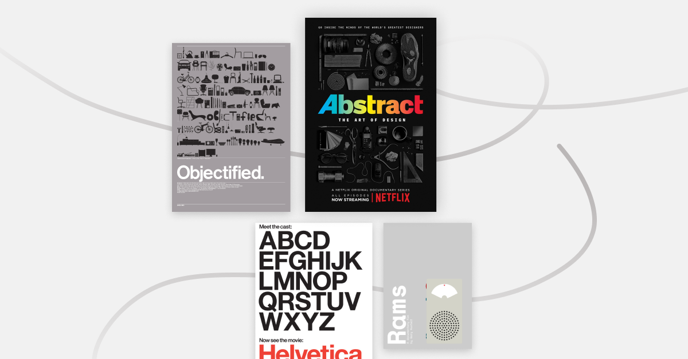

import Button from '@/components/Button';

Catching up with some design documentaries in the last few months during quarantine, here's my recommended list!

## Abstract: The Art of Design ([Free on Youtube](https://www.youtube.com/watch?v=q_k8fVNzbGU&list=PLuctemCzX-m4svPpBctWUp0oG__Lhglq9), Available on Netflix)

The two-season documentary series highlight artists across various fields of design. Each episode is an in-depth look of how design is implemented around our everyday life.
@abstractdesign

<Button to="https://www.youtube.com/watch?v=q_k8fVNzbGU&list=PLuctemCzX-m4svPpBctWUp0oG__Lhglq9">
  Watch Now
</Button>

## Helvetica ($3.99 rental on [Vimeo On Demand](https://vimeo.com/ondemand/helvetica3/232871579))

Discover the history and cultural impact of the famous typeface Helvetica, also known as Neue Haas Grotesk.

## Objectified ($3.99 rental on [Vimeo On Demand](https://vimeo.com/ondemand/objectified/232897036))

Documentary on the manufactured designed objects and the process of its creation. Also directed by the same director Gary Hustwit.

## Rams ($3.99 rental on [Vimeo on Demand](https://vimeo.com/ondemand/ramsfilm/291784379))

After interviewing Dieter Rams in Objectified, director Gary Hustwit started a new project to continue the conversation with him, further exploring this key design figure in influencing modern industrial design.

Got any favourite design documentaries to share? Share with me on [@juxtdesignco](https://twitter.com/juxtdesignco)
