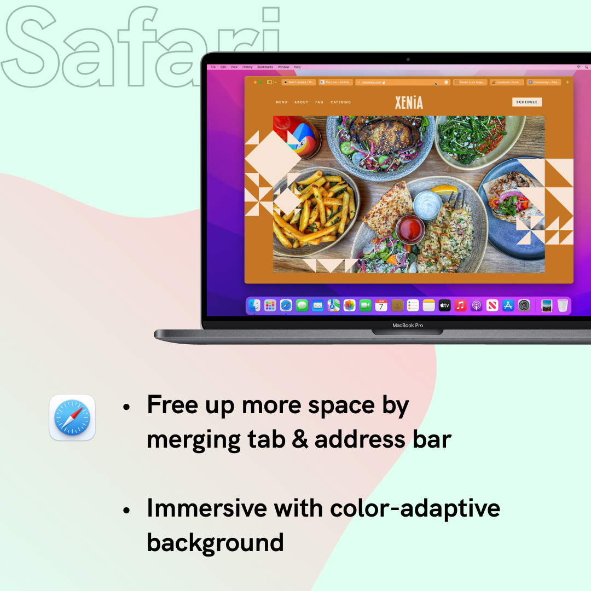
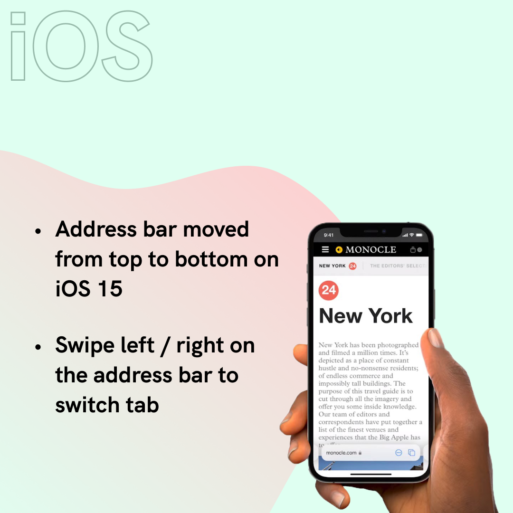
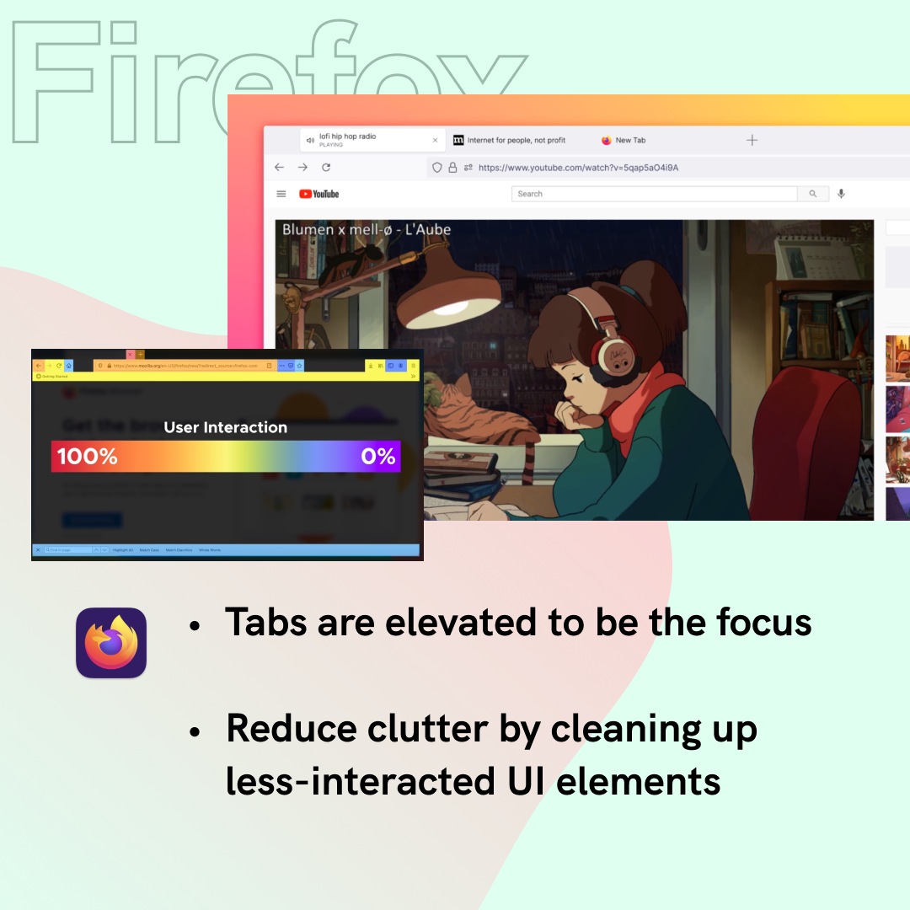

Brand new Safari and Firefox were both announced this month. Both versions received major design iterations. Which do you prefer?

Announced in WWDC, Apple's new Safari is more ground-breaking in terms of UI and interaction. Merged address & search bar aims to reduce occupied space, while color-adaptive background will help the browser blend into webpages. Safari also underwent some big changes on iOS too. Address bar has moved to the bottom for better reachability.

As for Mozilla's Firefox, changes stay at interface level. Tabs are elevated to the top and simplified toolbar. Right-click menu is now native that supports light & dark mode.

> 95% of what you see when you open a browser window belongs to the website that you’re there to view rather than Firefox itself.

[Behind the design: A fresh new Firefox](https://blog.mozilla.org/en/products/firefox/new-firefox-coming-june-1/)

What do you think and what change do you want for your browsers? [Safari](https://www.apple.com/macos/monterey-preview/) is coming this fall and [Firefox](https://www.mozilla.org/en-US/firefox/new/) update has launched on June 1.

Stay tuned for further walkthrough and review!
