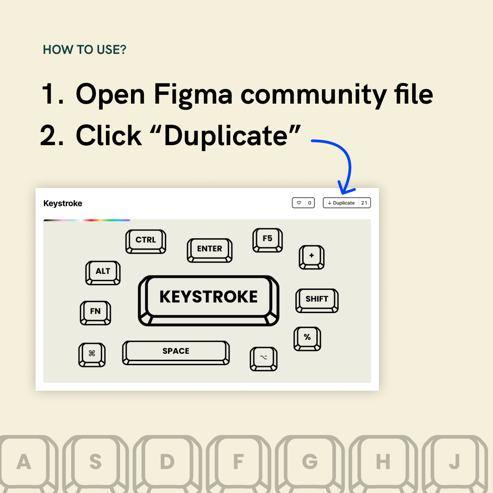
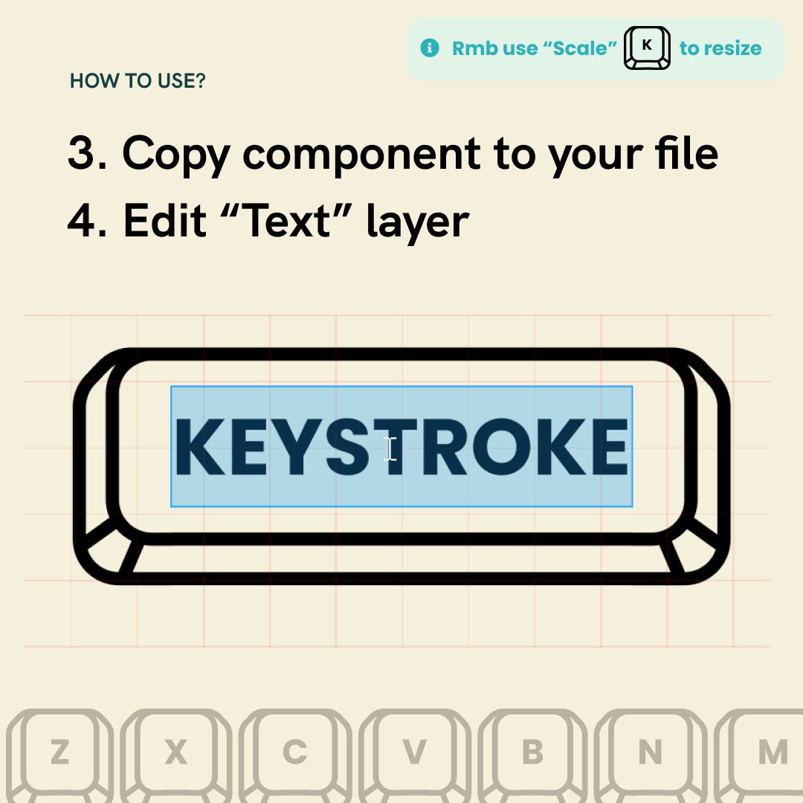

Introducing KEYSTROKE ⌨! My first Figma community template to create keycap quickly (with auto-layout support!). Quickly create keyboard shortcuts on Figma now!

## How to use?

1. Open figma community file
2. Click "Duplicate"
3. Copy the component to your own file
4. Start typing in the text layer in the middle

## Where can I download it?

[View file here](https://www.figma.com/community/file/979571292056443766) or search "Keystroke" on Figma Community or click

Remember to use scale ("K" key" to resize since borders are outlined already! Let me know what you think and how would you apply it to your design using #MadeByJUXT
