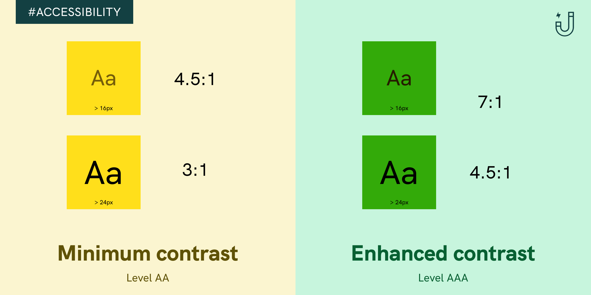
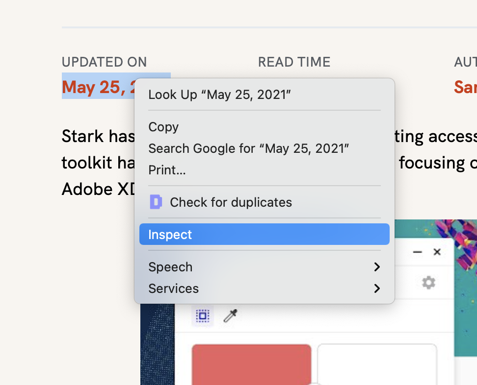
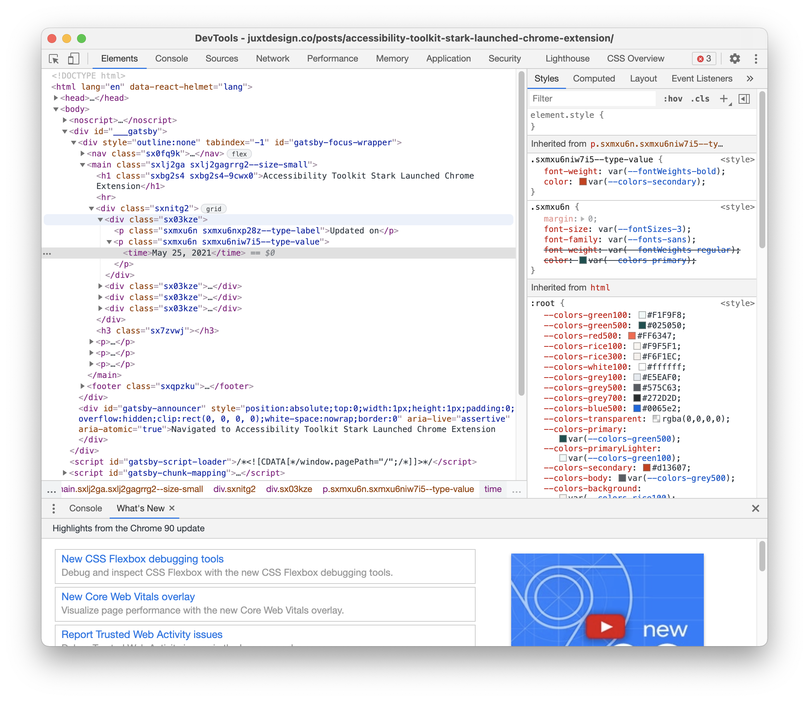
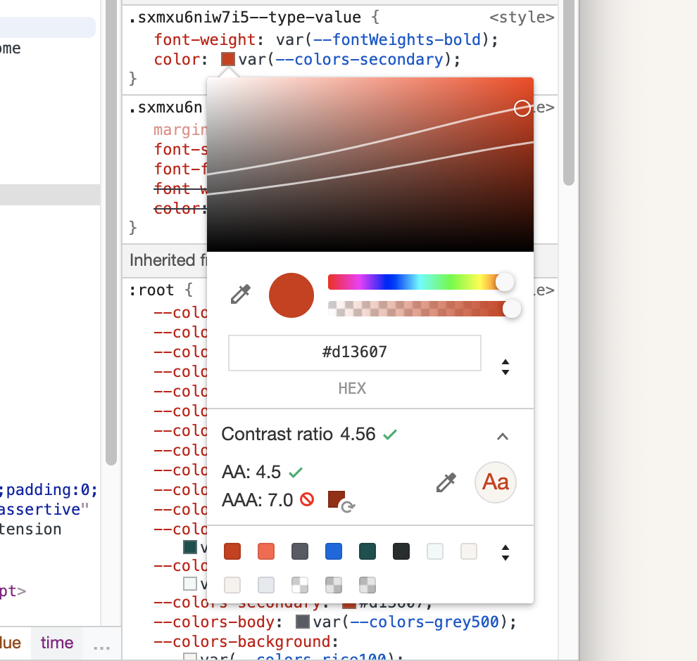
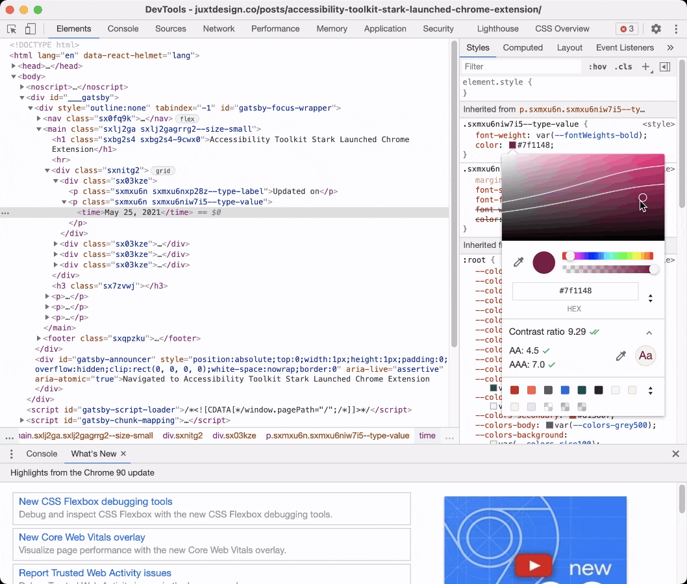
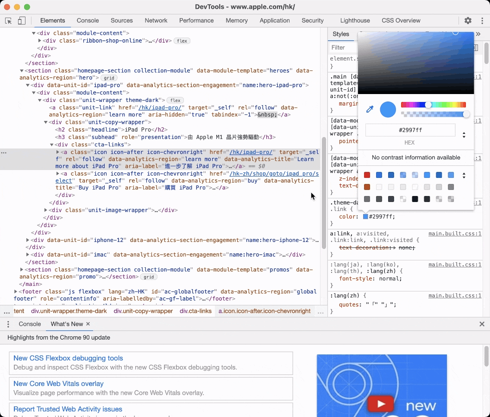

One simple step to enhance your website's accessibility is checking your colors. 8% of all men suffer from color vision deficiency (0.5% in women), so 1 in 12 males that visited your website may experience difficulties if your design is not accessible.

Until few years ago, colors on a website have to check one by one using contrast checker or by completing a site audit. Recently, I discovered Chrome Devtool shipped new feature that is very handy in fixing color accessibility issues.

## What is the standard of color accessibility?

The [Web Content Accessibility Guidelines](https://webaim.org/articles/contrast/) (WCAG) dictates the recommendations to make the web more accessible. Two sets of ratio are set for different font size

- Level AA (Minimum contrast): Contrast ratio should be at least 4.5:1 for normal text and 3:1 for large text
- Level AAA (Enhanced contrast): Contrast ration should be at least 7:1 for normal text and 4.5:! for large text

Then what is the definition of normal and large text? Although WCAG referenced to 14pt and 18pt for normal and large text, in web standard, pixel (px) is the common unit, which is 24px and 18.67 px respectively.

## How to use Chrome DevTools for checking color accessibility?

Best reason why you should try using Chrome DevTools is because it is free and probably installed in your computer already. Just browse any website and right click on elements you want to select, and tap on "Inspect".

Chrome DevTools will pop up a window. Focus on the right side, which state style properties. It's ok if you don't fully understand CSS but we are looking for properties related to color, like `color` for text color, `background-color` for background color.

Click on the square block with color, there will be a tooltip that allows you to pick new colors. We can also see a line is called "Contrast Ratio", clicking on the row will further expand in displaying all accessibility information.

We can see that the current color only passed AA standard, but failed on AAA standard. How can we fix that? While you can click on the suggested color block on the right to fix the issue, a new feature is indicator lines on the color spectrum, showing colors within the spectrum that is passing standard.

The top line refers to the AA standard, while the bottom line refers to AAA. Now you can easily pick any new colors that are accessible.

## What if there are no contrast information available?

By default, Chrome will pick the background color automatically, but if it is not available, we can add it manually. Click on the line below `color` and start typing `background-color: black`. Then click on the black color block and use color picker to pick the real background color.

## What other tools can I use to check color contrast?

Other than Chrome DevTools, there are a lot of other accessibility tools that can help you to create accessible design. A classic would be [WebAim's contrast checker](https://webaim.org/resources/contrastchecker/), [Coolors.co](https://coolors.co/contrast-checker) also offer a easy-to-use contrast checker. If you want to check your colors within your design tools, [Stark](https://getstark.co/) offers plugins for Figma, Sketch and Adobe XD as well!

Try Chrome DevTools today and let me [know](https://twitter.com/@juxtdesignco) if there are any accessibility tips that I'm missing!
